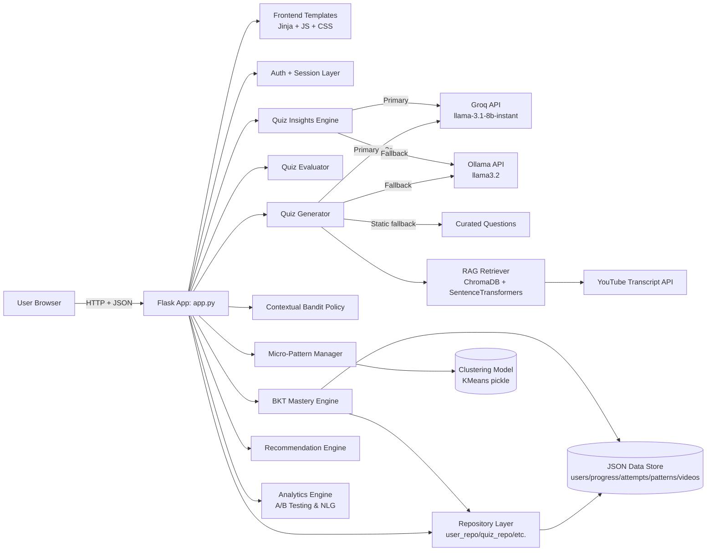
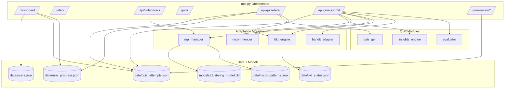
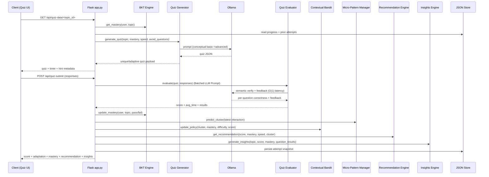

# Architecture — CogniLoop Learning Platform

This document describes the full technical architecture of the platform, including system layers, module boundaries, adaptive engine flow, and runtime request pipelines.

## 1) High-level system architecture

## 2) Layered architecture

### Presentation layer

- HTML views in `frontend/templates/`.
- CSS and client-side behavior in `static/`.
- **Design System**: Built on a bespoke "Warm Slate and Amber" palette (#1c1917, #d97706) for a premium academic aesthetic, utilizing *Plus Jakarta Sans* and responsive glassmorphism components.
- Dynamic pages:
  - dashboard,
  - video player with checkpoints,
  - quiz runtime,
  - quiz review history.

### Application layer (`app.py`)

- Owns HTTP routes and orchestration.
- Builds adaptive quiz payloads from:
  - user state,
  - progress history,
  - prior attempt history,
  - behavior profile.
- Persists attempt snapshots and dashboard aggregates.

### Domain services (`backend/`)

- `backend/quiz/quiz_generator.py`:
  - **3-tier LLM fallback**: Groq API (primary, ~2s) → Ollama local (fallback) → static questions.
  - conceptual question generation with trimmed prompt (~40% smaller than v1).
  - dynamic question count (6–10) and difficulty adaptation.
  - non-repetition filtering via `avoid_questions` deduplication.
- `backend/quiz/quiz_evaluator.py`:
  - semantic answer validation and per-question feedback.
- `backend/quiz/quiz_insights.py`:
  - **time-based diagnosis** per wrong answer (guessed < 5s / confused > 25s / misconception).
  - cheat-sheet concept mapping for wrong questions using `STATIC_CHEAT_SHEETS`.
  - Groq primary → smart fallback (non-generic, topic-aware).
- `backend/quiz/rag_retriever.py`:
  - Semantic transcript chunking and retrieval to mitigate hallucinations.
- `backend/adaptation/bandit_policy.py`:
  - Epsilon-Greedy Contextual Bandit mapping (Cluster+Mastery) to Difficulty.
- `backend/bkt/bkt_engine.py`:
  - Bayesian mastery update.
- `backend/adaptation/micro_pattern.py`:
  - behavior logging and KMeans cluster prediction.
- `backend/analytics/metrics.py`:
  - A/B testing framework calculating Normalized Learning Gain and statistical significance.
- `backend/repositories/`:
  - Data access layer abstracting file/DB operations with advisory fcntl locking.

### Infrastructure layer

- Local LLM runtime: Ollama (`llama3.2`).
- Transcript context fetch via YouTube transcript API.
- JSON-file persistence for deterministic local execution.
- Serialized clustering model under `models/`.

## 3) Module architecture map

## 4) Adaptive engine pipeline

## 5) Core runtime engines

### 5.1 Quiz generation engine

Input:

- topic id + title,
- watch-time transcript context,
- current difficulty,
- mastery estimate,
- behavior cluster + speed label,
- recent question stems to avoid.

Output:

- adaptive quiz payload,
- conceptual progression (basic -> advanced),
- unique stem set with hints.

Failure behavior:

- falls back to deterministic conceptual question bank if LLM/transcript fails.

### 5.2 Evaluation engine

- Primary path: LLM semantic verification of selected answer vs expected answer.
- Fallback path: normalized string-match correctness if model unavailable.
- Produces score, average time, and per-question feedback.

### 5.3 Mastery engine (BKT)

- Maintains probability of latent concept mastery per user/topic.
- Updates mastery after each attempt using Bayesian observation update + transition.

### 5.4 Contextual Bandit Adaptation Engine

- Maps state (`Learner Cluster` + `Mastery`) to an action (`easy`, `medium`, `hard`).
- Replaces static speed rules with an Epsilon-Greedy policy (default `epsilon=0.2`).
- Evaluates reward dynamically `(score / 100) * difficulty_multiplier` to push users to their threshold.

### 5.5 Behavior clustering engine

- Logs micro interactions (pause/rewatch/skip/watch%).
- Predicts behavior archetype using KMeans model.
- Feeds recommendation tone and adaptation context.

### 5.6 Recommendation and insight engines

- Recommendation engine returns action-level learning guidance.
- Insight engine returns AI-authored weak-topic focus and cheat-sheet style next steps.

## 6) API contract overview

### Web pages

- `GET /` (Landing page)
- `GET, POST /login` (Authentication)
- `GET, POST /register` (User onboarding)
- `GET /logout` (Session termination)
- `GET /dashboard` (Main adaptive hub)
- `GET /progress` (Learning analytics view)
- `GET /video/<topic_id>` (Video playback & checkpoints)
- `GET /quiz/<topic_id>` (Adaptive quiz interface)
- `GET /quiz-review` (History of all attempts)
- `GET /quiz-review/<attempt_id>` (Diagnostic question breakdown)

### JSON APIs

- `POST /api/video-track`
- `GET /api/user-progress/<video_id>`
- `GET /api/quiz-data/<topic_id>`
- `POST /api/quiz-submit`
- `GET /api/research-analytics`

## 7) Data model summary (JSON persistence)

- `data/users.json`: user credentials/profile.
- `data/user_progress.json`: watch position + percentage by user/topic.
- `data/quiz_attempts.json`: full attempt snapshots, per-question outcomes, adaptation, insights.
- `data/micro_patterns.json`: interaction telemetry records.
- `data/bkt_states.json`: mastery probability state by user/concept.
- `models/clustering_model.pkl`: serialized KMeans + metadata.

## 8) Request lifecycle snapshots

### A) Video tracking lifecycle

1. Frontend sends interaction snapshot to `POST /api/video-track`.
2. Server logs micro-pattern telemetry.
3. Server updates watch-state progress.
4. Behavior features become available for subsequent cluster prediction.

### B) Quiz generation lifecycle

1. Server loads user mastery + recent attempts.
2. Difficulty/speed context is derived.
3. Generator requests conceptual MCQs from LLM with anti-generic constraints.
4. Duplicate filter enforces novelty.
5. Timers/hints metadata added and returned to UI.

### C) Quiz submission lifecycle

1. Server evaluates each response.
2. Computes score/time metrics.
3. Updates speed profile + mastery estimate.
4. Predicts behavior cluster.
5. Creates recommendation + AI insights.
6. Persists full attempt and returns final response payload.

## 9) Extensibility points

- Replace JSON persistence with PostgreSQL/MongoDB by swapping load/save logic in `backend/repositories/`. Since the repository pattern is fully implemented, zero application logic changes are required.
- Add checkpoint-performance persistence endpoint for in-video quizzes.
- Add offline model fallback (rule-based distractor generation) for no-LLM mode.
- Introduce event bus (Redis/Kafka) for analytics decoupling at scale.

## 10) Reliability and fallback strategy

- Transcript retrieval uses multi-strategy attempts.
- LLM generation/evaluation guarded with timeout and exception handling.
- Deterministic fallback quiz/evaluation prevents user-facing hard failure.
- Version-aware model loading retrains clustering model on sklearn mismatch.
## 9) Quality Assurance & Testing Suite

The platform includes a comprehensive suite of **162 automated tests** covering every layer of the system.

### A) Test categories
- **Unit Tests**: Deep verification of the math behind the BKT engine, Bandit rewards, and diagnostic time boundaries.
- **Integration Tests**: Verification of the Repository pattern with file locking, the 3-tier LLM fallback logic (Groq -> Ollama -> Static), and RAG index pipelines.
- **Stress Tests**: Concurrency tests for file-based persistence under simulated high load.
- **End-to-End (E2E) Routes**: Full-stack verification of user flows (registration, login, video watch, quiz submit, and diagnostic review).

### B) CI/CD readiness
The codebase is structured for CI/CD integration with:
- `pytest` for all test execution.
- Deterministic JSON-based persistence for test isolation.
- Mocked LLM endpoints for consistent test results without external API costs.

## 10) Legal Compliance, Licensing, and API Access Ethics

### YouTube Player Integration
CogniLoop streams public educational videos using the official **YouTube IFrame Player API** in the frontend, complying with Sections 4.C & 4.D of the YouTube API Services ToS. No video media assets are self-hosted or cloned; original creator views, ads, and credits are fully preserved.

### Transcript Processing (Fair Use)
Captions are retrieved programmatically via `youtube-transcript-api` and semantic vector-chunked using local tools. Under U.S. Copyright Law (17 U.S.C. § 107), this constitutes transformative **Fair Use** for research and active testing purposes. Original author credits and video attribution metadata are preserved across all learning paths.

