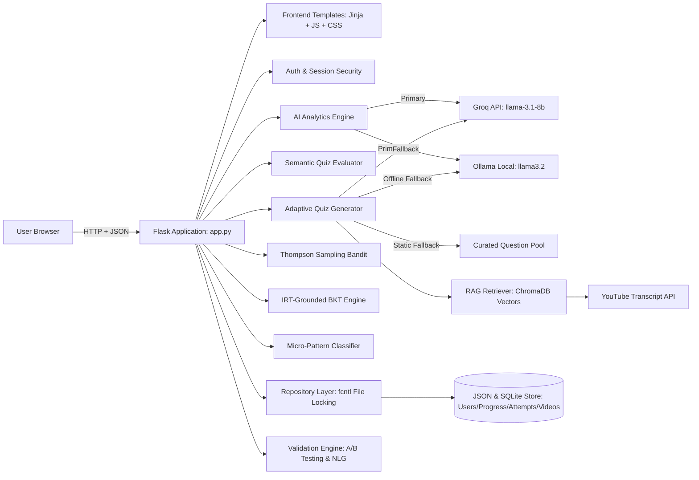

# Architecture: CogniLoop Learning Platform

**Author**: Kavya Aggarwal | **IEEE Research Project**

This document details the software engineering architecture of CogniLoop, covering presentation layers, algorithmic engines, data persistence, and scientific validation frameworks.

---

## 1. High-Level System Blueprint

```mermaid
flowchart LR
    U[User Browser] -->|HTTP + JSON| F[Flask Application: app.py]

    F --> T[Frontend Templates: Jinja + JS + CSS]
    F --> A[Auth & Session Security]
    F --> QG[Adaptive Quiz Generator]
    F --> QE[Semantic Quiz Evaluator]
    F --> AI[AI Analytics Engine]
    F --> CB[Thompson Sampling Bandit]
    F --> BKT[IRT-Grounded BKT Engine]
    F --> MP[Micro-Pattern Classifier]

    QG -->|Primary: ~2s| GR[Groq API: llama-3.1-8b]
    QG -->|Offline Fallback| O[Ollama Local: llama3.2]
    QG -->|Static Fallback| SF[Curated Question Pool]
    AI -->|Primary| GR
    AI -->|Fallback| O

    QG --> RAG[RAG Retriever: ChromaDB Vectors]
    RAG --> YT[YouTube Transcript API]
    F --> REP[Repository Layer: fcntl File Locking]
    REP --> D[(JSON & SQLite Store: Users/Progress/Attempts/Videos)]
    F --> AN[Validation Engine: A/B Testing & NLG]
```

---

## 2. Layered Software Architecture

### Presentation Layer (`frontend/` & `static/`)
- **Visual Identity**: Engineered with a high-contrast Warm Slate (`#1c1917`) and Amber (`#d97706`) palette, using *Plus Jakarta Sans* typography and responsive glassmorphism containers.
- **Client Security**: Integrates `security_guard.js` across all views to suppress right-click context menus, intercept Developer Tools shortcuts (`F12`, `Ctrl+Shift+I`, `Ctrl+U`), and protect presentation demonstrations from DOM extraction.
- **Interface Modules**: Dashboard analytics, video lecture player with embedded checkpoints, interactive quiz runtime, diagnostic review breakdowns, and printable executive PDF reports (`export_cheat_sheet.html`).

### Application Layer (`app.py`)
- Coordinates HTTP navigation routes and RESTful JSON endpoints.
- Manages user sessions and authentication using timing-attack resistant PBKDF2-HMAC-SHA256 password hashing.
- Orchestrates real-time educational adaptation by synthesizing historical attempts, watch-pace telemetry, and Bayesian mastery parameters into custom assessment payloads.

### Domain Intelligence Services (`backend/`)
- `backend/adaptation/bkt_engine.py`: **IRT-Grounded Bayesian Knowledge Tracing**. Models conceptual mastery as a latent binary state $P(L_n)$, dynamically adjusting Guess $P(G)$ and Slip $P(S)$ parameters based on difficulty tiers (Easy: $0.30/0.05$, Medium: $0.20/0.10$, Hard: $0.10/0.15$).
- `backend/adaptation/bandit_policy.py`: **Thompson Sampling Contextual Bandit**. Solves exploration-exploitation trade-offs across student states $s = \langle C, M_{bin} \rangle$ via Beta-Bernoulli conjugate distributions to route difficulty trajectories.
- `backend/adaptation/micro_pattern.py`: Models student interaction behaviors using $K$-Means clustering to classify learning pacing into Fast, Steady, and Detail-Oriented archetypes.
- `backend/quiz/quiz_generator.py`: Executes 3-tier adaptive generation (Groq -> Ollama -> Curated Static). Enforces strict conceptual focus and duplicate question suppression.
- `backend/quiz/rag_retriever.py`: Vectorizes lecture transcripts into sentence embeddings within `ChromaDB`, grounding LLM prompt assembly to eliminate factual hallucinations.
- `backend/quiz/quiz_insights.py`: Generates post-quiz diagnostic analyses, distinguishing between rushed guessing ($<5$ seconds) and deep conceptual confusion ($>25$ seconds), while presenting our roadmap for expert-curated textbook study modules.
- `backend/analytics/metrics.py`: Computes cohort statistical significance and Normalized Learning Gains ($\text{NLG} = \frac{\text{Post} - \text{Pre}}{100 - \text{Pre}}$).

### Repository & Persistence Layer (`backend/repositories/` & `data/`)
- Implements the Repository Pattern with POSIX `fcntl` advisory file locking, guaranteeing ACID consistency and thread safety across JSON storage structures without heavy database overhead.
- Supports seamless extensibility to PostgreSQL or MongoDB without requiring modifications to business application code.

---

## 3. Request & Adaptation Lifecycles

### A. Video Watch & Checkpoint Pipeline
1. The frontend player dispatches timestamp events to `POST /api/video-track`.
2. The server logs telemetry milestones and triggers in-video conceptual checkpoints at 30%, 65%, and 85% lecture thresholds.
3. Watch pacing features are updated and passed to the K-Means classifier to calibrate subsequent quiz difficulty routing.

### B. Adaptive Assessment Assembly
1. The user requests a topic quiz via `GET /api/quiz-data/<topic_id>`.
2. The orchestrator pulls current BKT mastery probabilities and behavioral cluster parameters.
3. The Thompson Sampling bandit selects the optimal question difficulty vector.
4. The RAG retriever fetches transcript slices from `ChromaDB`, instructing Groq/Ollama to generate fresh questions that pass deduplication filters.

### C. Diagnostic Review & Report Export
1. Upon submission (`POST /api/quiz-submit`), responses are semantically evaluated and BKT probabilities are updated.
2. The analytics engine builds a comprehensive review breakdown with personalized study drills and actionable growth tips.
3. Learners can export an academic revision cheat sheet (`/export-cheat-sheet/<attempt_id>`) formatted as a clean, printable executive report.

---

## 4. Quality Assurance & Verification

CogniLoop features an automated verification suite of **162 unit and integration tests** executing via `pytest`:
- **Mathematical Validation**: Confirms precision in Bayesian probability equations and Beta distribution convergence in Thompson Sampling.
- **Resilience Testing**: Simulates concurrent write contention across repository locking structures and tests the 3-tier LLM fallback logic under network isolation.
- **End-to-End Functional Coverage**: Validates all routing endpoints, authentication flows, timestamp processing, and report exports with zero regressions.

---

## 5. Compliance & Ethics

- Built in adherence to IEEE publishing guidelines and educational API usage standards.
- Utilizes official embedded YouTube IFrames without downloading or distributing proprietary audiovisual streams, fully honoring content authorship and Fair Use doctrine.
